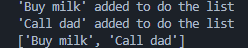

# Python Exercises Repository

Welcome to my Python Exercises repository. 
This repository contains solutions to various exercises focused on Python programming concepts.

## Table of contents

---

### [Session 1](#session-1)

   - [Exercise 1: Print a Greeting](#exercise-1-print-a-greeting)
   - [Exercise 2: Basic Arithmetic](#exercise-2-basic-arithmetic)
   - [Exercise 3: String Manipulation](#exercise-3-string-manipulation)
   - [Exercise 4: Lists](#exercise-4-lists)
   - [Exercise 5: Dictionaries](#exercise-5-dictionaries)
   - [Exercise 6: Tuples](#exercise-6-tuples)
   - [Exercise 7: Sets](#exercise-7-sets)
   - [Exercise 8: Conditional Statements](#exercise-8-conditional-statements)
   - [Exercise 9: For Loop](#exercise-9-for-loop)
   - [Exercise 10: While Loop](#exercise-10-while-loop)
   - [Exercise 11: Match Statement](#exercise-11-match-statement)
   - [Exercise 12: Define a Function](#exercise-12-define-a-function)
   - [Exercise 13: Function with Return Value](#exercise-13-function-with-return-value)
   - [Exercise 14: Function with Default Parameters](#exercise-14-function-with-default-parameters)
   - [Exercise 15: List Comprehension](#exercise-15-list-comprehension)
   - [Exercise 16: Nested Data Structures](#exercise-16-nested-data-structures)
   - [Exercise 17: Simple Calculator](#exercise-17-simple-calculator)

---

### [Session 2](#session-2)

   - [Exercise 1: FizzBuzz](#exercise-1-fizzbuzz)
   - [Exercise 2: Basic Data Filtering](#exercise-2-basic-data-filtering)
   - [Exercise 3: Simple To-Do List](#exercise-3-simple-to-do-list)
   - [Exercise 4: Temperature Converter](#exercise-4-temperature-converter)

---

# **Session 1**

In Session 1, I learned the fundamental concepts of Python, including basic syntax, data types, and control structures. The exercises covered essential topics such as variables, arithmetic operations, string manipulation, and the use of lists, dictionaries, tuples, and sets.

## **List of exercises:**  

### **Exercise 1: Print a Greeting**
       
       - Write a Python program that prints a greeting message, such as "Hello, Python!".

---

### **Exercise 2: Basic Arithmetic**
       - Create a program that:
          - Defines two variables, `a` and `b`, with numerical values.
          - Prints their sum, difference, product, and quotient.

---

### **Exercise 3: String Manipulation**
       - Define a variable `name` and assign it your name. Write a program that prints a message saying "Hello, [name]!" where `[name]` is the value of the variable.

---

### **Exercise 4: Lists**
       - Create a list called `universities` with at least five different university names.
          - Print the entire list.
          - Print the first and last university in the list.

---

### **Exercise 5: Dictionaries**
       - Create a dictionary called `student` with keys: `name`, `age`, and `grade`, and assign appropriate values to each key.
       - Write a program that prints each key-value pair in the dictionary.

---

### **Exercise 6: Tuples**
       - Define a tuple called `coordinates` with two values representing a point in 2D space (e.g., `(x, y)`).
       - Print the value of `coordinates` and access each element by its index.

---

### **Exercise 7: Sets**
       - Create a set called `colors` with the values: "red", "green", "blue".
       - Add another color to the set.
       - Try adding a duplicate color and observe what happens.
       - Print the set and remove one color from it.
       - Create another set named `light_colors` and merge `colors` and `light_colors`.

---

### **Exercise 8: Conditional Statements**
       - Write a program that:
         - Takes an input number from the user.
         - Checks if the number is positive, negative, or zero.
         - Prints an appropriate message based on the result.

---

### **Exercise 9: For Loop**
      - Create a list of numbers from 1 to 5.
      - Use a for loop to iterate through the list and print each number.

---

### **Exercise 10: While Loop**
      - Write a program that uses a while loop to print numbers from 1 to 5.
      - Ensure the loop terminates correctly.

---

### **Exercise 11: Match Statement (Python 3.10+)**
      - Write a program that:
      - Asks the user to input a grade (e.g., "A", "B", "C", "D", or "F").
      - Use a match statement to print a corresponding message for each grade:
          - "A": "Excellent!"
          - "B": "Good job!"
          - "C": "Fair."
          - "D": "Needs improvement."
          - "F": "Failing."
      - Handle invalid input by printing a default message.

---

### **Exercise 12: Define a Function**
      - Write a function called `greet` that takes a name as an argument and prints "Hello, [name]!".
      - Call the function with your own name.

---

### **Exercise 13: Function with Return Value**
      - Define a function called `square` that takes a number as an argument and returns its square.
      - Print the result of calling this function with different numbers.

---

### **Exercise 14: Function with Default Parameters**
      - Write a function called `multiply` that takes two parameters, `a` and `b`, and returns their product.
      - Set a default value of 1 for the parameter `b`.
      - Test the function with and without providing the second argument.

---

### **Exercise 15: List Comprehension**
      - Create a list of numbers from 1 to 10.
      - Use list comprehension to create a new list that contains the squares of these numbers.
      - Print the new list.

---

### **Exercise 16: Nested Data Structures**
      - Create a dictionary where the keys are names of students and the values are lists of their grades.
      - Write a function that takes the dictionary and prints the average grade for each student.

---

### **Exercise 17: Simple Calculator**
      - Write a program that:
          - Defines a function `calculate` which takes three parameters: two numbers and an operator (`+`, `-`, `*`, `/`).
          - Performs the operation and returns the result.
          - Ask the user for the two numbers and the operator, then call the function and print the result.

---

# **Session 2** 

In this session, I built upon the knowledge from Session 1, diving into more advanced topics like data filtering, function definitions, and practical applications.

## **List of exercises:** 

### **Exercise 1: FizzBuzz**
      
      - Write a FizzBuzz function that takes an integer `n` as a parameter.
      - Implement FizzBuzz logic to print:
          - "Fizz" for multiples of 3
          - "Buzz" for multiples of 5
          - "FizzBuzz" for multiples of both 3 and 5
          - The number itself for other numbers
      - Call the function for numbers 1 to 20.
      
* Description: Create a function that prints "Fizz" for multiples of 3, "Buzz" for multiples of 5, and "FizzBuzz" for multiples of both.

* Input: Numbers from 1 to 20.

  
* Output: 

---

### **Exercise 2: Basic Data Filtering** 

      - Create a list that contains a mix of integers, strings, and floats.
      - Use list comprehension to create a new list that contains only the integers from the original list.
      - Print the filtered list of integers.
       
* Description: Filter a list that contains a mix of integers, strings and floats to extract only integers.

* Input: Mixed list

  
* Output:

---

### **Exercise 3: Simple To-Do List** 

      - Create an empty list called `todo_list`.
      - Define functions:
          - `add_task(task)` that adds a task to the list.
          - `show_tasks()` that prints all tasks in the list.
          
* Description: Create a simple to-do list application with functions to add and show tasks.

* Input: Tasks to add and an input to show the current tasks. 

  
* Output:

---

### **Exercise 4: Temperature Converter** 
      
      - Write a function `celsius_to_fahrenheit(celsius)` that converts Celsius to Fahrenheit.
      - Print the converted temperature for 22ºC, 46ºC, 51ºC, and 76ºC.

* Description: Create a function that converts Celsius into Fahrenheit.

* Input: Different Celsius values (22ºC, 46ºC, 51ºC, and 76ºC).

  
* Output:

